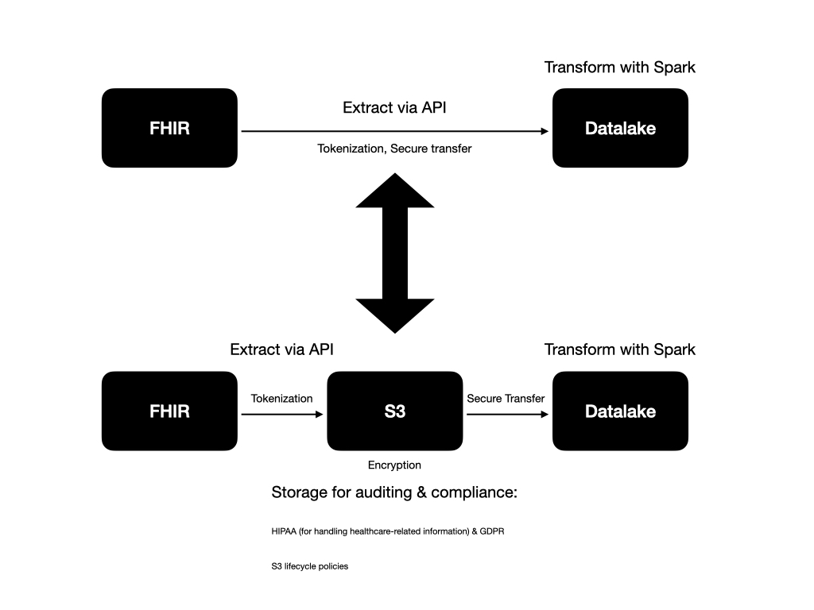

# Architecture

This documents explains my thinking process from discovering the use-case to delivering a solution.





```
emis-dataeng-itw/
├── .azuredevops/                      # Azure DevOps CI/CD pipeline definitions
│   ├── ci-pipeline.yml                # Continuous Integration pipeline
│   └── cd-pipeline.yml                # Continuous Deployment pipeline
├── terraform/                         # Terraform infrastructure as code
│   ├── main.tf                        # Main Terraform configuration
│   ├── variables.tf                   # Terraform variables definition
│   └── outputs.tf                     # Terraform outputs definition
├── common/                            # Shared code across projects
│   ├── etl/
│   │   ├── abstract_etl.py            # Abstract ETL class
│   │   └── abstract_elt.py            # Abstract ELT class
│   └── utils/
│       ├── __init__.py
│       └── s3_handler.py              # S3 interaction utility
├── fhir/                              # FHIR project
│   ├── src/
│   │   ├── ingest_bundle_to_landing/       # IngestBundleToLanding microservice
│   │   │   ├── Dockerfile             # Dockerfile for IngestBundleToLanding
│   │   │   ├── main.py                # Main script for IngestBundleToLanding
│   │   │   ├── requirements.txt       # Dependencies for IngestBundleToLanding
│   │   │   └── ...                    # Other source files for IngestBundleToLanding
│   │   ├── transform_bundle_json_to_tabular/           # TransformBundleJsonToTabular microservice
│   │   │   ├── Dockerfile             # Dockerfile for TransformBundleJsonToTabular
│   │   │   ├── main.py                # Main script for TransformBundleJsonToTabular
│   │   │   ├── requirements.txt       # Dependencies for TransformBundleJsonToTabular
│   │   │   └── ...                    # Other source files for TransformBundleJsonToTabular
│   ├── tests/
│   │   ├── ingest_bundle_to_landing/
│   │   │   ├── test_main.py           # Tests for IngestBundleToLanding
│   │   │   └── ...                    # Other test files for IngestBundleToLanding
│   │   ├── transform_bundle_json_to_tabular/
│   │   │   ├── test_main.py           # Tests for TransformBundleJsonToTabular
│   │   │   └── ...                    # Other test files for TransformBundleJsonToTabular
│   ├── airflow/
│   │   ├── dags/
│   │   │   └── fhir_dag.py            # Airflow DAG for FHIR project
│   │   └── plugins/
│   │       └── custom_operator.py     # Custom Airflow operators for FHIR
│   ├── env/
│   │   ├── .env.development           # Environment variables for development
│   │   ├── .env.staging               # Environment variables for staging
│   │   └── .env.production            # Environment variables for production
│   └── docker-compose.yml             # Docker Compose for FHIR project (for local development)
├── xxbc/                              # XXBC project (structured similarly to FHIR project)
├── docker-compose.override.yml        # Overrides for local development for all projects
├── docker-compose.dev.yml             # Docker Compose for development environment
├── docker-compose.staging.yml         # Docker Compose for staging environment
├── docker-compose.prod.yml            # Docker Compose for production environment
└── README.md                          # Repository documentation
```
